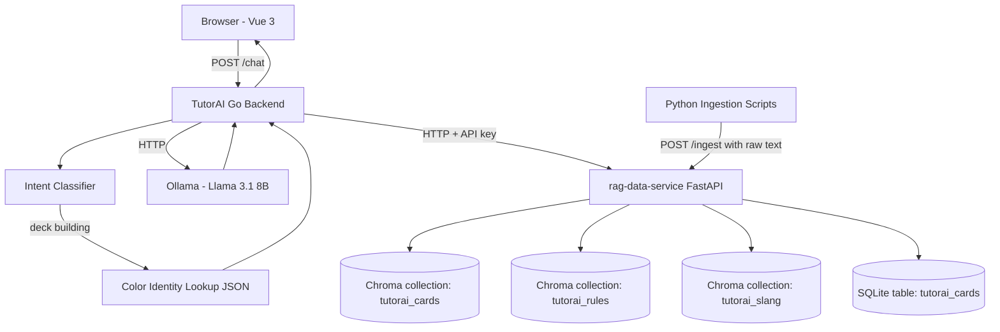

# Architecture

## System Overview

TutorAI is split across two repositories with different release strategies:

- **`tutorai` (public / open source)** — The application layer: Vue 3 frontend, Go backend API, retrieval orchestration, Ollama LLM integration, and Python ingestion scripts. Anyone can clone this, wire it to their own data backend, and run it.
- **`rag-data-service` (private)** — A shared REST API (Python/FastAPI) that hosts the vector databases and serves retrieval results. Hosts curated data for TutorAI and future RAG projects. It is the proprietary layer.

This is an open-core model: the app code demonstrates the architecture publicly (portfolio value), while the data backend remains private (monetization path and reuse across projects).

## Repository Split

| Layer | Language | Repo | Visibility |
|---|---|---|---|
| Vue 3 frontend | TypeScript | `tutorai` | Public |
| App backend / API | Go | `tutorai` | Public |
| Intent classification | Go | `tutorai` | Public |
| Context assembly + prompts | Go | `tutorai` | Public |
| Ollama LLM integration | Go | `tutorai` | Public |
| Data service client | Go | `tutorai` | Public |
| Ingestion scripts | Python | `tutorai` | Public |
| Color identity lookup | JSON | `tutorai` | Public |
| Data service API | Python | `rag-data-service` | **Private** |
| Vector DB (Chroma) | Python | `rag-data-service` | **Private** |
| Card + rules + slang corpus | — | `rag-data-service` | **Private** |
| Auth / API key management | Python | `rag-data-service` | **Private** |

## System Diagram



## Components

### Vue 3 Frontend (`tutorai` — public, TypeScript)
- **What it does:** Simple chat UI — input box, message history, response display
- **Lives in:** `/frontend/`
- **Key responsibilities:** Send POST /chat requests, display responses, render message history
- **Does NOT handle:** Any retrieval, LLM calls, or business logic

### Go App Backend (`tutorai` — public)
- **What it does:** Receives chat queries, runs intent classification, calls the data service for retrieval, assembles context, calls Ollama, returns response
- **Lives in:** `/backend/`
- **Framework:** Chi router over `net/http`
- **Key responsibilities:** HTTP routing, intent classification, data service client calls, context/prompt assembly, Ollama HTTP calls
- **Does NOT handle:** Vector search, data storage — all delegated to the data service

### Python Ingestion Scripts (`tutorai` — public)
- **What it does:** Downloads source data, normalises and chunks it, then POSTs **raw text + metadata** to the data service `/ingest/tutorai` endpoint. Embedding is handled inside the data service.
- **Lives in:** `/scripts/`
- **Language:** Python — better ecosystem for JSON wrangling and text chunking
- **Key responsibilities:** Fetch Scryfall bulk data, chunk rules by rule number, load slang glossary, POST batches to the data service
- **Does NOT handle:** Embedding, vector storage, SQLite writes — all delegated to the data service
- **Why public:** Users who self-host can run these against their own data service instance

### RAG Data Service (`rag-data-service` — private, Python/FastAPI)
- **What it does:** Hosts Chroma vector DBs and SQLite card data. Exposes a REST API for retrieval and ingest. Serves multiple RAG apps via namespaced endpoints.
- **Lives in:** Separate private repo
- **Key responsibilities:** Vector search, structured card filtering, corpus management, API key auth
- **Multi-tenancy:** Each app (TutorAI, future projects) gets its own namespace. API key scope controls access.
- **Does NOT handle:** LLM calls, intent classification, prompt assembly

## Folder Structure

### `tutorai` (public repo)
```
tutorai/
├── CLAUDE.md
├── README.md
├── SETUP.md
├── .env.example
├── go.mod
├── go.sum
├── docs/
│   ├── project-overview.md
│   ├── tech-stack.md
│   ├── architecture.md
│   ├── decisions.md
│   └── data.md
├── tickets/
├── backend/
│   ├── cmd/
│   │   └── server/
│   │       └── main.go          # Entry point
│   ├── internal/
│   │   ├── api/
│   │   │   └── chat.go          # POST /chat handler
│   │   ├── retrieval/
│   │   │   ├── intent.go        # Intent classification (Ollama call)
│   │   │   ├── lookup.go        # Color identity exact lookup
│   │   │   └── client.go        # HTTP client for rag-data-service
│   │   ├── llm/
│   │   │   └── ollama.go        # Ollama HTTP client
│   │   └── context/
│   │       └── assemble.go      # Prompt / context assembly
│   └── config/
│       └── config.go            # Env var loading
├── scripts/                     # Python ingestion scripts
│   ├── requirements.txt
│   ├── ingest_cards.py
│   ├── ingest_rules.py
│   └── ingest_slang.py
├── data/
│   ├── color_identity_lookup.json
│   └── slang_glossary.json
├── frontend/
│   └── src/
│       ├── App.vue
│       ├── components/
│       │   └── ChatWindow.vue
│       └── api/
│           └── chat.ts
└── tests/
    └── (Go test files co-located with source, Python tests in scripts/)
```

### `rag-data-service` (private repo)
```
rag-data-service/
├── README.md
├── .env.example
├── requirements.txt
├── main.py
├── api/
│   ├── retrieve.py          # POST /retrieve/{app_id}
│   └── ingest.py            # POST /ingest/{app_id}
├── store/
│   ├── chroma.py
│   └── sqlite.py
├── auth/
│   └── apikey.py
└── apps/
    ├── tutorai/
    └── [future-app]/
```

## Data Flow

### Deck Building Query ("build me a golgari aristocrats commander deck under $100")
1. Frontend POSTs `{"query": "..."}` to Go backend `POST /chat`
2. Intent classifier (Go → Ollama HTTP call) returns `deck_building`
3. Lookup resolves `golgari` → `{B, G}` from local JSON — no network call
4. Go backend calls data service: `POST /retrieve/tutorai/cards` with `{color_identity: ["B","G"], format: "commander", max_price: 100, query: "aristocrats sacrifice death trigger"}`
5. Data service filters SQLite, runs Chroma semantic search, returns top-k cards as JSON
6. Go backend assembles prompt, calls Ollama `POST /api/chat`
7. Response returned to frontend

### Rules Query ("how does deathtouch work with trample")
1. Frontend POSTs query to Go backend
2. Intent classifier returns `rules_question`
3. Go backend calls data service: `POST /retrieve/tutorai/rules` with `{query: "deathtouch trample"}`
4. Data service returns top-k rule chunks
5. Go backend assembles prompt, calls Ollama, returns response

## Self-Hosting
Users who clone `tutorai` set `DATA_SERVICE_URL` and `DATA_SERVICE_API_KEY` in `.env`, run the Python ingestion scripts against their own data service instance, and are fully independent of the hosted service.

## Key Constraints & Assumptions
- Data service must be running before the Go backend can answer questions
- Color identity lookup is local JSON — no service call needed
- Ollama must be running locally
- In v1, both services run on the same machine

## What's Intentionally Simple for Now
- No streaming — plain request/response only
- No conversation history — each query is stateless
- No caching
- API key auth only in v1 — JWT with scoped claims is the v2 upgrade path
- Both services local in v1 — separate host deployment comes later
